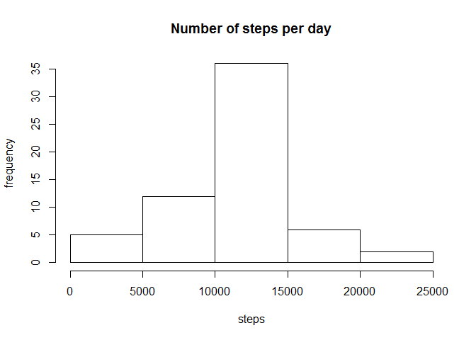

# Reproducible Research: Peer Assessment 1
###Loading and preprocessing the data

Load required libraries

```r
library(plyr)
library(timeDate)
library(lattice) 
```
Here the .csv file containing the activity data is imported into R and the date column is converted into a time/date object:


```r
activeData<-read.csv("activity.csv")
activeData$date<-strptime(activeData$date,"%Y-%m-%d")
```
###What is mean total number of steps taken per day?
Calculating number of steps taken per day, and plot as a histogram.

```r
sumSteps<-ddply(activeData,c("date"),summarise,tot= sum(steps,na.rm=TRUE))
hist(sumSteps$tot,xlab = "steps", ylab = "frequency", main = "Number of steps per day")
```

 

Mean and median steps taken per day:

```r
mean(sumSteps$tot)
```

```
## [1] 9354.23
```

```r
median(sumSteps$tot)
```

```
## [1] 10395
```
###What is the average daily activity pattern?
Time series plot of the 5-minute interval and the average number of steps taken, averaged across all days.

```r
meanSteps5min<-ddply(activeData,c("interval"), summarise, means = mean(steps, na.rm=TRUE))
plot(meanSteps5min$interval,meanSteps5min$means, type = "l", xlab = "time (5 minutes)", ylab = "average steps")
```

 

The 5-minute interval that contains the maximum number of steps:

```r
meanSteps5min$interval[which(meanSteps5min$means==max(meanSteps5min$means))]
```

```
## [1] 835
```

###Imputing missing values
The total number of missing values in the dataset:

```r
sum(is.na(activeData$steps))
```

```
## [1] 2304
```
Below is a strategy to fill all of the missing values in the dataset using the mean for that 5-minute interval.

```r
activeData$stepsFill=activeData$steps
for (i in 1:length(activeData$steps))##iterate through table
{
  if(is.na(activeData$steps[i]) == TRUE)##if na is found
  {
    inter=activeData$interval[i]##find the 5 -min interval
    ##replace na with mean for that 5-minute interval
    activeData$stepsFill[i] = meanSteps5min$means[which(meanSteps5min$interval==inter)]
  }
}
```
Calculating number of steps taken per day of filled dataset, and plot as a histogram.

```r
sumSteps2<-ddply(activeData,c("date"),summarise,tot= sum(stepsFill))
hist(sumSteps2$tot,xlab = "steps", ylab = "frequency", main = "Number of steps per day")
```

 

Mean and median steps taken per day:

```r
mean(sumSteps2$tot)
```

```
## [1] 10766.19
```

```r
median(sumSteps2$tot)
```

```
## [1] 10766.19
```
Do these values differ from the estimates from the first part of the assignment?

Yes.

What is the impact of imputing missing data on the estimates of the total daily number of steps?

Reduces the frequency of days with total steps < 5000.

###Are there differences in activity patterns between weekdays and weekends?
Created a new factor variable in the dataset with two levels - "weekday" and "weekend" indicating whether a given date is a weekday or weekend day.

```r
for (i in 1:length(activeData$steps))
{
  if (isWeekday(activeData$date[i]) == TRUE)
  {
    activeData$week[i]='weekday'
  }
  if (isWeekend(activeData$date[i]) == TRUE)
  {
    activeData$week[i]='weekend'
  }
}
##subset weekend and weekday data
weekdaySubset=activeData[which(activeData$week == 'weekday'),]
weekendSubset=activeData[which(activeData$week == 'weekend'),]
```
Calculating the 5-minute interval and the average number of steps taken, averaged across all weekday days or weekend days.

```r
meanSteps5minWeekday<-ddply(weekdaySubset,c("interval",'week'), summarise, means = mean(stepsFill, na.rm=TRUE))
meanSteps5minWeekend<-ddply(weekendSubset,c("interval","week"), summarise, means = mean(stepsFill, na.rm=TRUE))
finalWeek=rbind(meanSteps5minWeekday,meanSteps5minWeekend)
```
Plots of weekend and weekday 5-minute interval and the average number of steps taken.

```r
xyplot(means ~ interval | week, data = finalWeek, type = "l",
       layout = c(1,2), xlab="time (5 minutes)",ylab="average steps")
```

 
